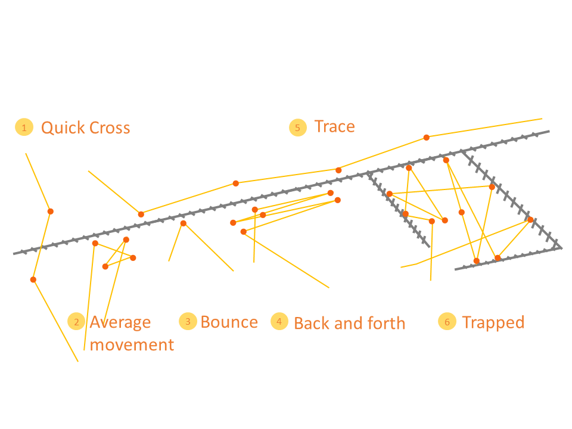
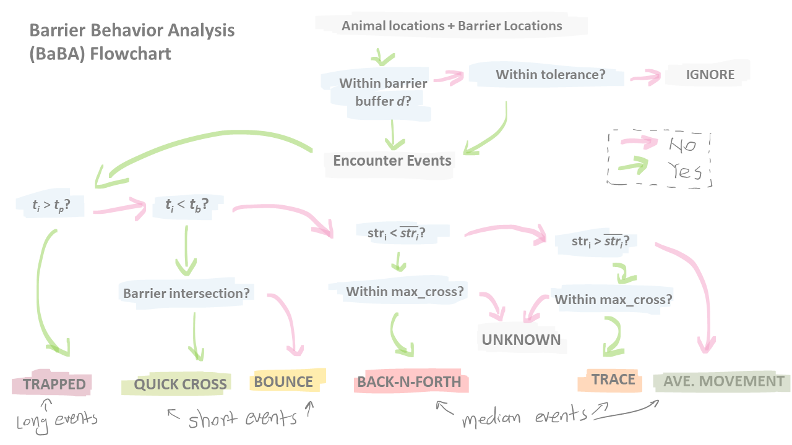

# Barrier Behavior Analysis
## Description
Barrier Behavior Analysis (BaBA)is a spatial- and temporal-explicit method to identify and classify barrier behaviors, fence behaviors in our case, based on GPS tracking data and linear spatial features. Barrier behaviors can be used to examine permeability of barriers for animal movement.

The 6 kinds of behaviors that BaBA classifies is: bounce, trace, back-n-forth, average movement, quick cross, trapped. See illustration:

To install the latest development version of BaBA, in an R session, type: 
**devtools::install_github("wx-ecology/BaBA")**

## BaBA Workflow

## Updates
V1.1 (April 10, 2021)
1. Improved the visualization of exported images 
2. Added time unit option and unified all temporal parameter units 

## Relevant publication: 
Xu W, Dejid N, Herrmann V, Sawyer H, Middleton AD. Barrier Behaviour Analysis (BaBA) reveals extensive effects of fencing on wide-ranging ungulates. J Appl Ecol. 2020;00:1–9. https://doi.org/10.1111/1365-2664.13806

